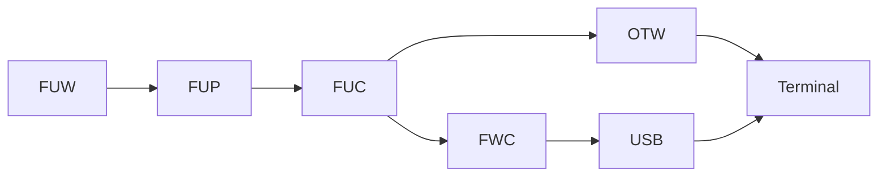

# ME Firmware Notes

## Risks and Recovery
### 2711P PanelView Plus v5 Warning
For v5 terminals, a failed upgrade could easily leave the internal CompactFlash card in an unusable state.  Always create an imaged backup of the known-good state prior to attempting an upgrade.  It is recommended to perform a backup of the original CompactFlash card, restore the image to a separate new card, and then upgrade the latter card.

#### 2711P PanelView Plus v5 Backup
From a Linux host, use fdisk to discover the drive letter and dd to create the backup:
```code
sudo fdisk -l
sudo umount /dev/sdX
sudo dd if=/dev/sdX of=~/imagename.img bs=1M status=progress
```
#### 2711P PanelView Plus 5 Restore
From a Linux host, use fdisk to discover the drive letter and dd to restore the backup:
```code
sudo fdisk -l
sudo umount /dev/sdX
sudo dd if=~/imagename.img of=/dev/sdX bs=1M status=progress
```
### 2711P PanelView Plus v6 / v7 Series A Warning
For v6 or v7 Series A terminals, a failed upgrade could leave the terminal in an unusable but recoverable state.  There should be a copy of the as-shipped firmware in the read-only storage onboard the terminal.  Use the Maintenance Menu to get it back to an out-of-the-box state.
```code
First press the RESET switch, then press and hold the DEFAULT button until it gets to the maintenance menu.

Using a keyboard, press DOWN and then LEFT to select Special Boot Action: Restore Factory Defaults.

Press UP and then ENTER to proceed.  Wait for factory reset to complete.
```

### 2711P PanelView Plus v7 Series B Note
For v7 Series B terminals, firmware is packaged and distributed to the terminals differently; the ME firmware functions are irrelevant.  They are still considered ME terminals for purposes of download, upload, etc. while running normally.

## Lexicon
The firmware for ME terminals can take various forms.  This is an attempt to disambiguate them.<br>
<br>
Firmware Upgrade Wizard (FUW): Installs the firmware kit to a computer.<br>
Firmware Upgrade Pack (FUP): The firmware kit in an archived form.<br>
Firmware Upgrade Card (FUC): The firmware kit in an expanded form.<br>
Firmware Card (FWC): A firmware kit expanded in a form specifically for removable media (i.e. USB or memory card).<br>
Over-The-Wire (OTW): A firmware kit expanded in a form specifically for transmission over a network.<br>



## Folder Paths
After installation of the FUW, the corresponding FUP should be available in this folder:<br>
```code
C:\Program Files (x86)\Rockwell Software\RSView Enterprise\FUPs
```
During creation of a FWC, or while transferring OTW, the selected FUP is expanded to the FUC in this folder.<br>
```code
C:\Users\Public\Documents\RSView Enterprise\Temp\temp
```

## File Structure
### FUP
The *.FUP file is an OLE 2.0 container that holds all of the file streams for the FUC.  Most of the useful streams are compressed.<br>
For v5 FUPs, there are many files needed, including at least one file that is excluded from the FWC but necessary for OTW.<br>
For v6/v7A FUPs, ignoring KepDrivers, there is a singular large *.IMG file that has the majority of the content.  One example: <br>
```code
DIRSIZE_INFORMATION
FUWautorun.exe
PRODUCT_VERSION_INFORMATION
SC <DATE>.IMG
upgrade.inf
VERSION_INFORMATION
```
The file 'upgrade.inf' is a manifest that describes how to build the FWC and OTW forms from the FUC.  It also contains the values used to build upgrade.dat, which is NOT included as a stream in the FUP, probably because it needs to change based on user selections i.e. KepDrivers.<br>
```code
[version]
Platform=(number)
OS=(version string)
ME=(version string)
KEP=(version string)
MINOS=(version string)
MAXOS=(version string)
ARD=(number)

[FWC]
upgrade.dat=\upgrade\upgrade.inf
(filename in FUC=file path in FWC, 1 line per entry)
AddRAMSize:(size in bytes)
AddISCSize:(size in bytes)
AddFPSize:(size in ???)

[OTW]
upgrade.dat=\upgrade\upgrade.inf
(filename in FUC=file path in OTW, 1 line per entry)
AddRAMSize:(size in bytes)
AddISCSize:(size in bytes)
AddFPSize:(size in ???)

[KEPDRIVERS]
(driver name=size in bytes, 1 line per entry)
```

For v5 terminals, 'MEFileList.inf' is a manifest that describes which existing files to delete on the terminal.<br>
```code
[info]
ME=(version string)
SizeOnDisk=(size in bytes)

[MEFILES]
(file paths, 1 line per entry)
```