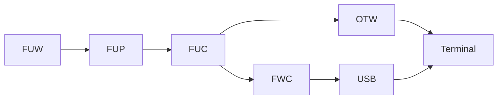

# ME Firmware Notes

## Risks and Recovery
### 2711P PanelView Plus v5 Warning
For v5 terminals, a failed upgrade could easily leave the internal CompactFlash card in an unusable state.  Always create an imaged backup of the known-good state prior to attempting an upgrade.  It is recommended to perform a backup of the original CompactFlash card, restore the image to a separate new card, and then upgrade the latter card.

#### 2711P PanelView Plus v5 Backup
From a Linux host, use fdisk to discover the drive letter and dd to create the backup:

```code
sudo fdisk -l
sudo umount /dev/sdX
sudo dd if=/dev/sdX of=~/imagename.img bs=1M status=progress
```

#### 2711P PanelView Plus 5 Restore
From a Linux host, use fdisk to discover the drive letter and dd to restore the backup:

```code
sudo fdisk -l
sudo umount /dev/sdX
sudo dd if=~/imagename.img of=/dev/sdX bs=1M status=progress
```

### 2711P PanelView Plus v6 / v7 Series A Warning
For v6 or v7 Series A terminals, a failed upgrade could leave the terminal in an unusable but recoverable state.  There should be a copy of the as-shipped firmware in the read-only storage onboard the terminal.  Use the Maintenance Menu to get it back to an out-of-the-box state.

```code
First press the RESET switch, then press and hold the DEFAULT button until it gets to the maintenance menu.

Using a keyboard, press DOWN and then LEFT to select Special Boot Action: Restore Factory Defaults.

Press UP and then ENTER to proceed.  Wait for factory reset to complete.
```

### 2711P PanelView Plus v7 Series B Note
For v7 Series B terminals, firmware is packaged and distributed to the terminals differently; the ME firmware functions are irrelevant.  They are still considered ME terminals for purposes of download, upload, etc. while running normally.

## Lexicon
The firmware for ME terminals can take various forms.  This is an attempt to disambiguate them.<br>

| Abbreviation | Description
|--------------|------------
| FUW          | Firmware Upgrade Wizard.  Installs the firmware kit to a computer.
| FUP          | Firwmare Upgrade Pack.  The firmware kit in an archived form.
| FUC          | Firmware Upgrade Card.  The firmware kit in an expanded form.  Note that while some tools refer to the Firmware Upgrade Card as the end product, here it is used to describe the intermediate form, so that the end product can follow one of the subsequent names.
| FWC          | Firmware Card.  A firmware kit expanded in a form specifically for removable media (i.e. USB or memory card).
| OTW          | Over-The-Wire.  A firmware kit expanded in a form specifically for transmission over a network.



## Folder Paths
Helper binaries are installed to this folder, and get transferred to the terminal in order to supply functionality needed for firmware upgrade.  Some terminals (v7 series A?) maintain a copy onboard the terminal at \\Windows\\FUWhelper.dll.  Some files for v5 and earlier no longer provided in newer versions (v13+?).

```code
C:\Program Files (x86)\Rockwell Software\RSView Enterprise
```

| File             | Purpose
|------------------|--------
| FUWCover3xX.exe  | "Cover" program used only for terminals v5 and earlier to show firmware upgrade status.  Terminals v6+ have a progress bar integrated and don't use this or any equivalent.
| FUWCover4xM.exe  | "Cover" program used only for terminals v5 and earlier to show firmware upgrade status.  Terminals v6+ have a progress bar integrated and don't use this or any equivalent.
| FUWCover4xX.exe  | "Cover" program used only for terminals v5 and earlier to show firmware upgrade status.  Terminals v6+ have a progress bar integrated and don't use this or any equivalent.
| FUWhelper3xX.dll | Firmware "Helper" file that works similar to the regular "Helper" file onboard the terminal and provides additional functions.
| FUWhelper4xA.dll | Firmware "Helper" file that works similar to the regular "Helper" file onboard the terminal and provides additional functions.
| FUWhelper4xM.dll | Firmware "Helper" file that works similar to the regular "Helper" file onboard the terminal and provides additional functions.
| FUWhelper4xX.dll | Firmware "Helper" file that works similar to the regular "Helper" file onboard the terminal and provides additional functions.
| FUWhelper6xA.dll | Firmware "Helper" file that works similar to the regular "Helper" file onboard the terminal and provides additional functions.
| FUWhelper6xX.dll | Firmware "Helper" file that works similar to the regular "Helper" file onboard the terminal and provides additional functions.
| RemoteHelper.dll | Regular "Helper" file that should already be onboard terminal.  Included here just as a note that it exists in the same location as the firmware helpers.

It isn't clear which devices use which files in all cases.  General guidance:

| Suffix | Platform
|--------|--------
| 4xM    | PanelView Plus 400/600 (Mozart?)
| 4xX    | PanelView Plus 700-1500 (Raptor?)
| 6xA    | PanelView Plus 6 400/600
| 6xX    | PanelView Plus 6 700-1500

Each FUW should install the corresponding FUP to this folder:

```code
C:\Program Files (x86)\Rockwell Software\RSView Enterprise\FUPs
```

During creation of a FWC, or while transferring OTW, the selected FUP is expanded to the FUC in this folder.

```code
C:\Users\Public\Documents\RSView Enterprise\Temp\temp
```

## File Structure
### FUP
The *.FUP file is an OLE 2.0 container that holds all of the file streams for the FUC.  Most of the useful streams are compressed.<br>
For v5 FUPs, there are many files needed, including at least one file that is excluded from the FWC but necessary for OTW.<br>
For v6/v7A FUPs, ignoring KepDrivers, there is a singular large *.IMG file that has the majority of the content.  One example: <br>

```code
DIRSIZE_INFORMATION
FUWautorun.exe
PRODUCT_VERSION_INFORMATION
SC <DATE>.IMG
upgrade.inf
VERSION_INFORMATION
```

The file 'upgrade.inf' is a manifest that describes how to build the FWC and OTW forms from the FUC.  It also contains the values used to build upgrade.dat, which is NOT included as a stream in the FUP, probably because it needs to change based on user selections i.e. KepDrivers.<br>

```code
[version]
Platform=(number)
OS=(version string)
ME=(version string)
KEP=(version string)
MINOS=(version string)
MAXOS=(version string)
ARD=(number)

[FWC]
upgrade.dat=\upgrade\upgrade.inf
(filename in FUC=file path in FWC, 1 line per entry)
AddRAMSize:(size in bytes)
AddISCSize:(size in bytes)
AddFPSize:(size in ???)

[OTW]
upgrade.dat=\upgrade\upgrade.inf
(filename in FUC=file path in OTW, 1 line per entry)
AddRAMSize:(size in bytes)
AddISCSize:(size in bytes)
AddFPSize:(size in ???)

[KEPDRIVERS]
(driver name=size in bytes, 1 line per entry)

[PVPCE]
(filename in FUC=file path in terminal, 1 line per entry)
```

For v5 terminals, 'MEFileList.inf' is a manifest that describes which existing files to delete on the terminal.<br>

```code
[info]
ME=(version string)
SizeOnDisk=(size in bytes)

[MEFILES]
(file paths, 1 line per entry)
```

For v5 terminals, 'upgrade.dat' calculates the Internal Storage Card (ISC) size as the sum of the 'upgrade.inf' AddISCSize and 'MEFileList.inf' SizeOnDisk values.  If KepDrivers are in use, it also sums in the 'MEFileList.inf' Overhead size, plus the size of the selected drivers.